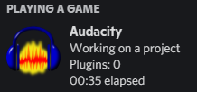

# AudacityDiscordRPC
Discord RPC for Audacity

## Requirements
``Node.js``

``Git (optional)``

``Audacity``

## Installation
*If you're on Windows, make sure to run ``npm i windows-build-tools`` in an Administrator command prompt first so you can install dependencies correctly.*
1. ``git clone https://github.com/davidjcralph/AudacityDiscordRPC`` (If you don't have Git just go to **Clone or download** and click **Download ZIP**)
2. ``cd AudacityDiscordRPC``
3. ``npm i`` (or ``yarn``)
4. ``npm start`
5. Open Audacity and check your Discord status!

## Screenshot

## Credits
Thanks to [FireController1847](https://github.com/FireController1847/photoshop-rich-presence) for making an Adobe Photoshop rich presence utility which I used for reference.

## License
[MIT](https://github.com/davidjcralph/AudacityDiscordRPC)